# Uber Clone App

Este proyecto es una aplicación móvil de reserva de vehículos. Esta aplicación utiliza **React Native**, **Expo**, **Stripe** para pagos, **PostgreSQL** como base de datos, y **Google Maps** para la visualización de mapas. A continuación, se muestra una descripción detallada de la funcionalidad y las tecnologías utilizadas.

## 📋 Descripción

La aplicación permite a los usuarios registrarse, buscar viajes, seleccionar un conductor, pagar con Stripe, y gestionar sus viajes en su perfil. Los conductores también pueden gestionar sus viajes y recibir pagos en tiempo real. La aplicación está optimizada para dispositivos móviles y proporciona una experiencia de usuario fluida.

## ⚙️ Tech Stack

-   **React Native**
-   **Expo**
-   **Stripe**
-   **PostgreSQL**
-   **Google Maps**
-   **Tailwind CSS (NativeWind)**
-   **Zustand** para la gestión del estado
-   **Clerk** para la autenticación

## 🔋 Características

-   **Onboarding**: Proceso de bienvenida con pantallas de introducción para los nuevos usuarios.
-   **Autenticación con Google y Email**: Inicio de sesión seguro con Google o email.
-   **Página de Inicio con Localización**: Muestra la ubicación actual del usuario en Google Maps.
-   **Buscar y Seleccionar un Viaje**: Busca viajes disponibles cercanos, selecciona un conductor y confirma el viaje.
-   **Pago con Stripe**: Realiza pagos de manera segura utilizando Stripe.
-   **Historial de Viajes**: Revisa los viajes anteriores con detalles completos.
-   **Perfil de Usuario**: Gestiona tu cuenta, actualiza información y visualiza estadísticas.
-   **Mensajería**: En desarrollo, permite la comunicación entre conductor y pasajero.

## 🤸 Capturas de Pantalla

### 1. Páginas de Onboarding

  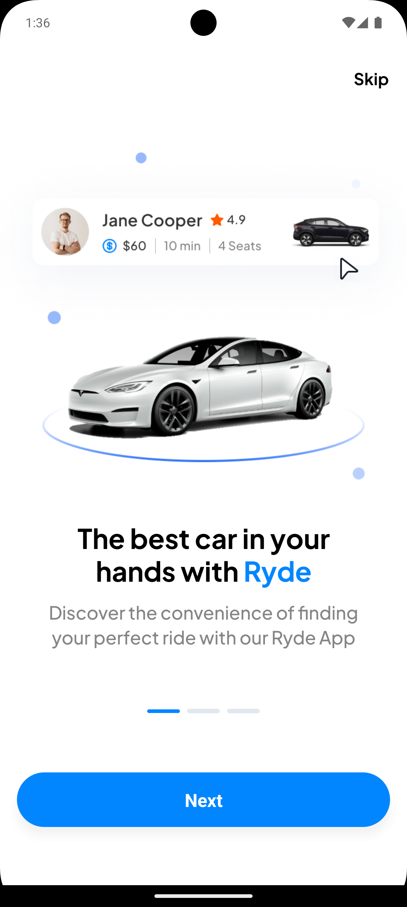
  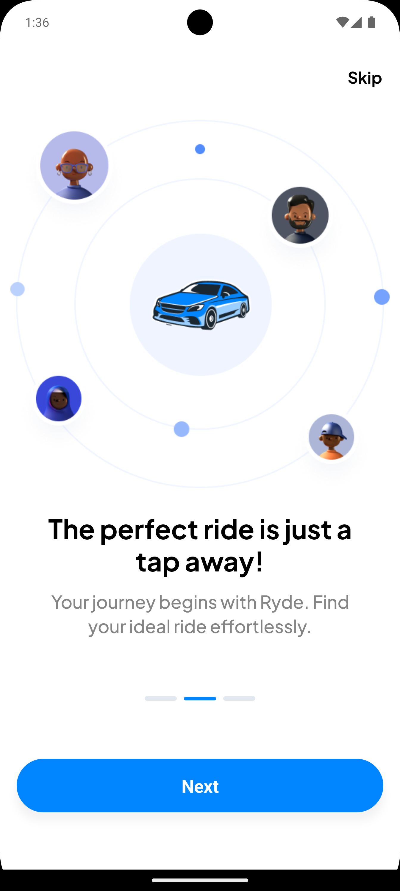
  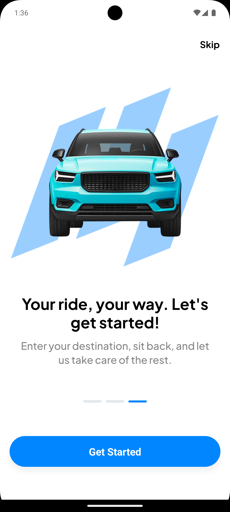

### 2. Páginas de Registro y Login

  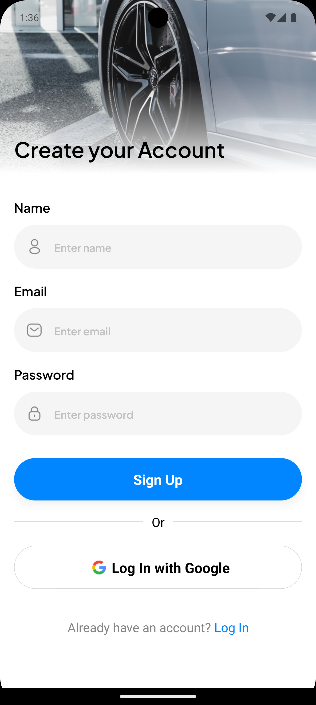
  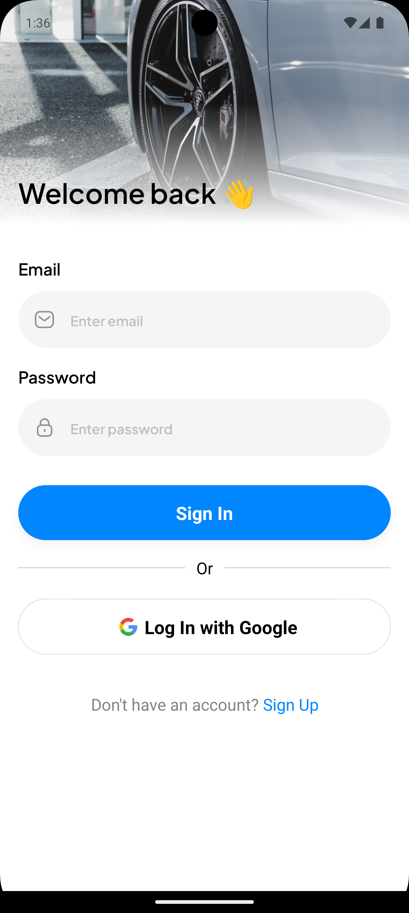

### 3. Página de Inicio y Búsqueda de Localización

  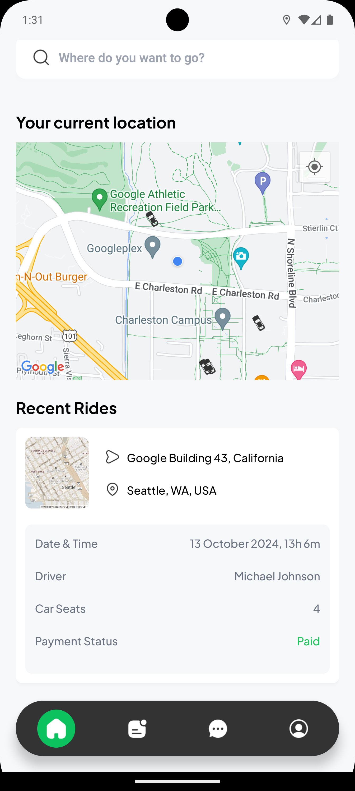
  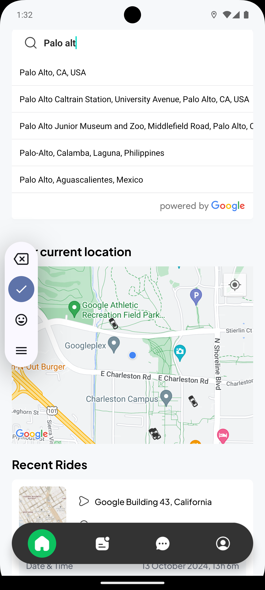

### 4. Buscar, Seleccionar y Confirmar Viaje

  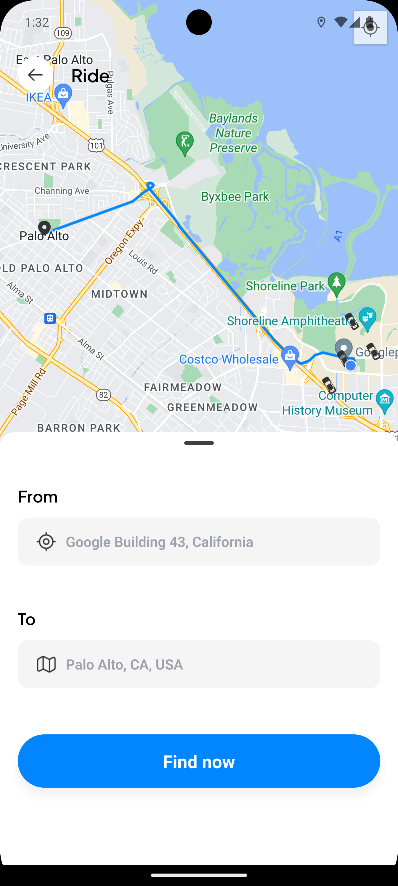
  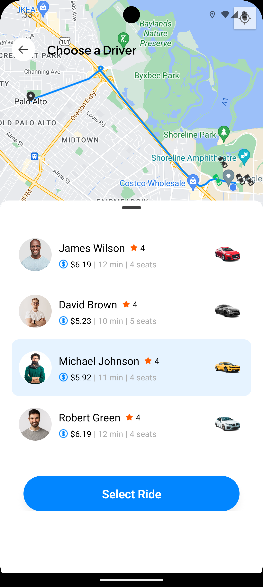
  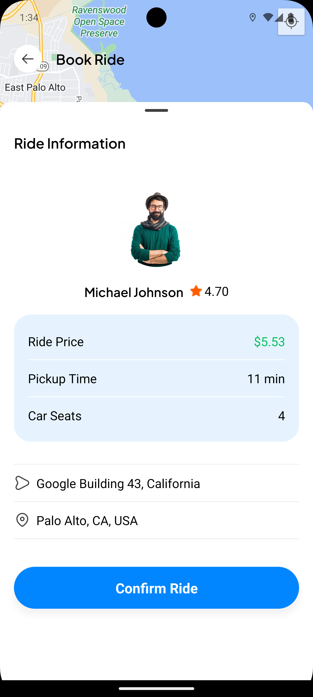

### 5. Pago con Stripe y Confirmación de Pago

  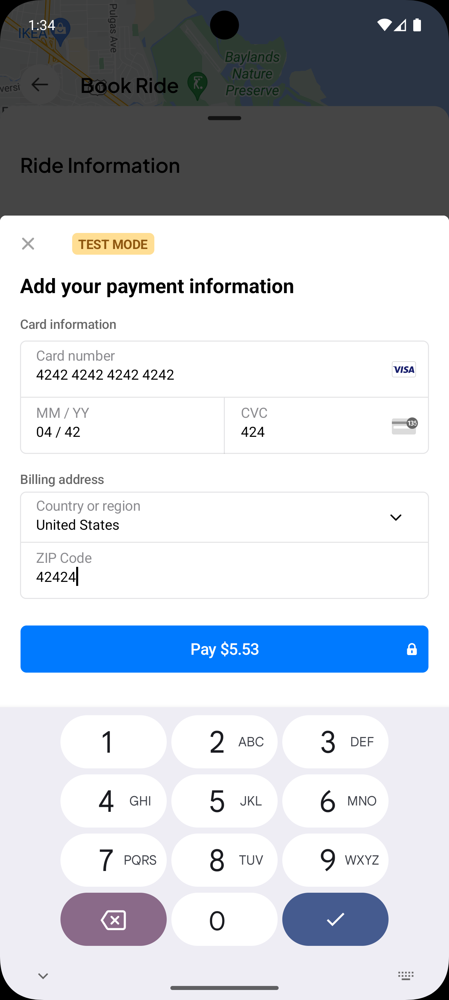
  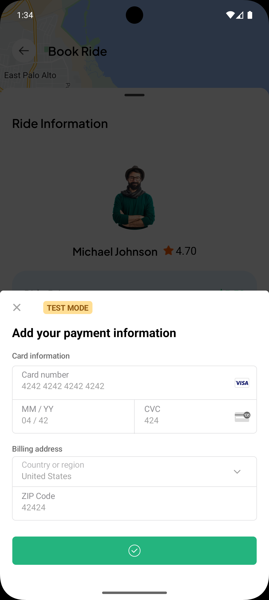
  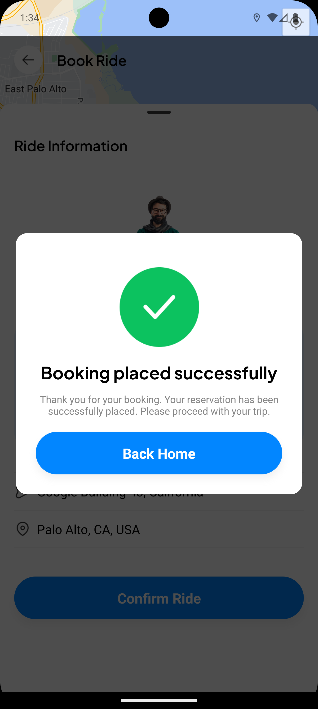

### 6. Historial de Viajes y Perfil de Usuario

  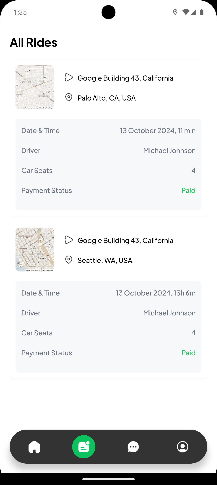
  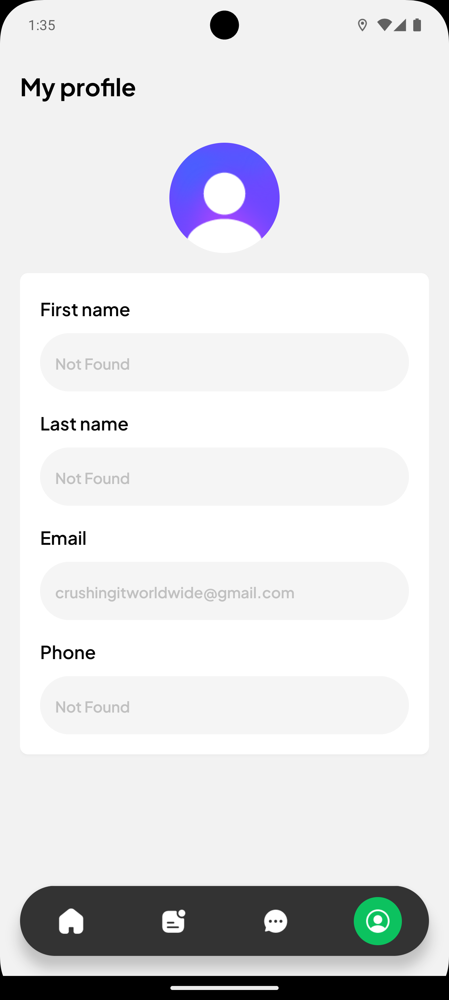

### 7. Página de Mensajería (En desarrollo)

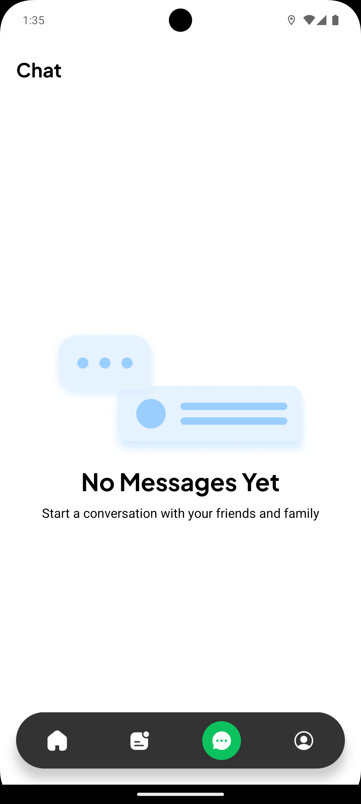
